# CCSA: Python-oefeningen
Maak kennis met Python aan de hand van deze oefeningen.

## 💻 Vereiste configuratiestappen

>ℹ️ Dit stappenplan is uitgewerkt voor VS Code, maar je mag ook een andere IDE gebruiken. Zorg dan zelf dat je configuratie klopt.

>⚠️ Installeer eerst Python én VS Code volgens de instructies in de slides: Chamilo > Documenten > Slides > H0 - Inleiding (laatste slide).

### Github Classroom-repo aanmaken

1. Maak een GitHub-repository aan door de Classroom-link op Chamilo te volgen. ⚠️ Let op: dit is niet hetzelfde als zelf een repo opzetten. Je moet de link gebruiken!

2. Clone je persoonlijke classroom-repository naar je PC. Indien dit gevraagd wordt, selecteer de optie om de fork "for my own purposes" te gebruiken. 

>ℹ️ Weet je niet hoe je een repository kan clonen? 
>
> Volg eerst en vooral de instructies in de [Git@HOGENT gebruikersgids](https://hogenttin.github.io/git-hogent-gids/installatie-config/) om Git te installeren. Git is vereist om de volgende stappen te kunnen volgen.
> 
> Clonen, pushen, committen, ... van/naar Git kan op veel manieren. Hieronder enkele mogelijke opties:
> 1. Werken via de command line, zoals beschreven in de stappen na installatie in de Git@HOGENT gebruikersgids.
> 2. De eenvoudige, visuele app [Github Desktop](https://desktop.github.com/download/) gebruiken om Github-repositories te beheren (enkel beschikbaar voor Windows en macOS).
> 3. Als je in VS Code werkt, met de [ingebouwde Git-functionaliteit](https://code.visualstudio.com/docs/sourcecontrol/intro-to-git#_open-a-git-repository).

### Configuratie VS Code 

#### Je workspace instellen

1. Open in VS Code de hoofdmap van je repo (File > Open Folder...). Dit wordt je workspace.

    In de explorer links zou je nu de inhoud van je repo moeten zien staan:

    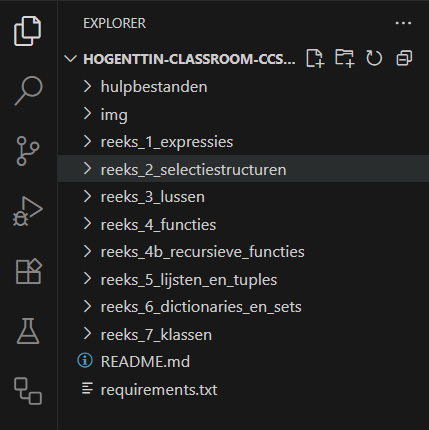

    Je kunt de mappen openklikken en bestanden weergeven door erop te klikken.


>💡 Markdown-bestanden zoals deze README kun je in VS Code visualiseren met `Ctrl+Shift+V`.

#### Opzetten van de virtual environment (venv)
Het is aanbevolen per Python-project een _virtual environment_ te gebruiken. Volg onderstaande stappen om deze op te zetten.

1. Open het Command Palette (`Ctrl+Shift+P`), zoek naar `Python: Create Environment...`, en selecteer dit commando.
2. Kies `Venv`:

    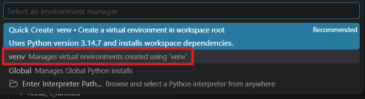

3. Selecteer de python interpreter, die je reeds geïnstalleerd hebt van python.org:

    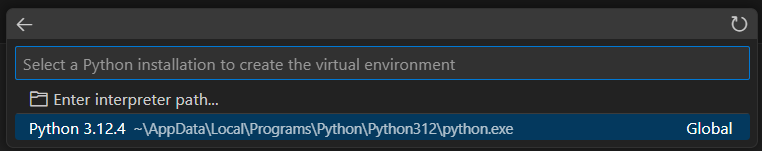

4. Vink aan dat je de dependencies uit `requirements.txt` wil installeren en bevestig met OK:
    
    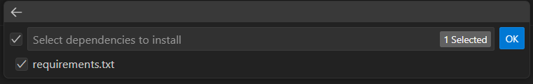

5. Een melding toont de vooruitgang van het aanmaken van de environment. Dit kan enkele minuten duren.

    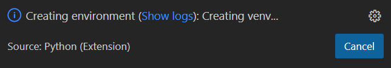

    Je krijgt bevestiging in een nieuwe melding:

    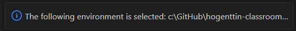

6. Na bovenstaande bevestiging, kun je testen of de environment succesvol wordt geactiveerd. 

    Open `hulpbestanden/helloworld.py` en voer de module uit door rechtsboven op het driehoekje te klikken. Normaal wordt de virtuele environment automatisch geactiveerd zodra de terminal wordt geopend in VS Code. Je kan dit zien omdat er **(.venv)** voor elke prompt in de terminal verschijnt. De uitvoer zou er ongeveer als volgt moeten uitzien:
    ```powershell
    PS C:\GitHub\CCSA-Python-oefeningen-studentenversie-test> & C:/GitHub/CCSA-Python-oefeningen-studentenversie-test/.venv/Scripts/Activate.ps1
    (.venv) PS C:\GitHub\CCSA-Python-oefeningen-studentenversie-test> & C:/GitHub/CCSA-Python-oefeningen-studentenversie-test/.venv/Scripts/python.exe c:/GitHub/CCSA-Python-oefeningen-studentenversie-test/helloworld.py
    Welkom bij de Python-oefeningen!
    ```

>ℹ️ Als je op Windows de foutmelding **Activate.ps1 cannot be loaded because running scripts is disabled on this system** krijgt, typ dan volgend commando in de powershell terminal:
>```powershell
>Set-ExecutionPolicy -ExecutionPolicy RemoteSigned -Scope CurrentUser -Force
>```
>Sluit de terminal in VS Code en probeer stap 6 opnieuw uit te voeren.

#### Configureren van de pytest-omgeving

1. Klik links op het maatbeker-icoon en selecteer: Configure Python Tests > pytest > . Root directory

    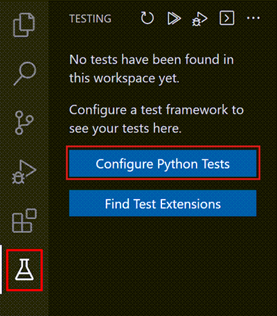
    
    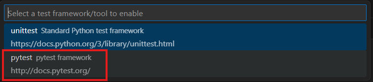
    
    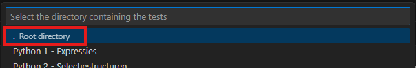

2. De tests worden nu automatisch herkend en kunnen uitgevoerd worden met de run-knop:

    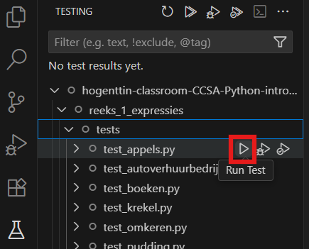

    Na uitvoeren krijgen geslaagde tests een groen vinkje, en niet-geslaagde tests een rood kruisje (bij een fail) of een rode stip (bij een error of timeout). Het doel is uiteraard een oplossing te vinden waarvoor alle tests slagen.

>ℹ️ Als je een foutje gemaakt hebt bij de configuratie van de tests kun je dit altijd nog terug rechtzetten:
>    - typ `CTRL+Shift+P`
>    - zoek naar *Python: Configure tests* en doorloop bovenstaande stappen opnieuw.

### Extra: debuggen
Wil je je python-code debuggen? In [deze tutorial van VS Code](https://code.visualstudio.com/docs/python/python-tutorial?originUrl=%2Fdocs%2Fpython%2Fpython-tutorial#_configure-and-run-the-debugger) lees je hoe dit kan.

## ⚙️ Beginnen aan de oefeningen

1. Verken de bestanden in de explorer (klik linksboven op het icoontje met de bestanden om de explorer weer te geven). In elke submap met naam `reeks_*` vind je een reeks oefeningen. Raadpleeg steeds de README in de submap vóór je aan een reeks oefeningen begint.

    Per oefening zijn er drie bestanden:
    - `<nr>_<naam-oefening>.md`: de opdracht (visualiseer deze in VS Code met `CTRL+Shift+V`, of bekijk ze op GitHub in je browser);
    - `<naam-oefening>.py`: hier schrijf je de code;
    - `test_<naam-oefening>.py` (in de map `tests`): automatische testen, deze bestanden wijzig je niet.

>⚠️ Maak zelf geen files aan en wijzig de mappenstructuur niet.

2. Open `hulpbestanden/studentengegevens.txt`. Vul je studentennummer, voornaam en familienaam in (géén extra lijnen toevoegen). 

    Voorbeeld:

    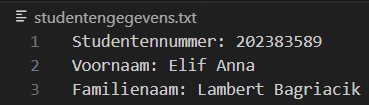

>⚠️ Zorg dat je studentennummer correct in `studentengegevens.txt` staat, anders krijg je mogelijk geen punten. 

3. Bewaar je wijzigingen. Commit en push regelmatig naar GitHub.

    In VS Code gebruik je het vertakkingen-icoon links om git-acties (commit, push, pull...) uit te voeren.:

    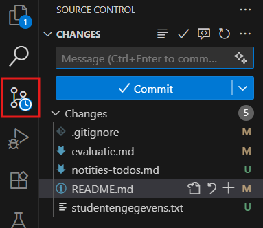

## 📝 Evaluatie

Het aandeel volledig juist opgeloste oefeningen bepaalt je score voor dit onderdeel (zie de studiefiche om te zien voor welk percentage van de punten dit telt).

Je kunt het evaluatiescript in `hulpbestanden/evaluatiescript.py` gebruiken om je score zelf te berekenen:
1. Voer het script uit (met de play-knop rechtsboven of via de terminal).
2. Je score wordt na afloop in de console weergegeven en weggeschreven naar een .csv-bestand.
3. Let wel: dit script gebruikt jouw lokale tests en instellingen, als je hierin wijzigingen hebt aangebracht, zal je uiteindelijke score mogelijk afwijken.

## 📣 Problemen? Laat het ons weten!
Het is de eerste keer dat we deze oefeningen via GitHub Classroom aanbieden. Tot vorig jaar werden deze oefeningen via het oefeningenplatform Dodona aangeboden. Omdat Dodona dit jaar betalend wordt, hebben we voor dit gratis alternatief gekozen. Er kunnen nog enkele kinderziekten in het project zitten. Als jullie fouten zien (typfouten, inhoudelijke fouten of fouten in de testen) of als bepaalde zaken niet werken zoals verwacht, laat het zeker weten via het forum op Chamilo.

## 🧠 Aan de slag!
Deze oefeningen helpen je om Python te leren en om complexe problemen stap voor stap op te lossen. De geoefende vaardigheden zijn nuttig voor dit vak (ook voor het examen) én in je latere carrière. Het is absoluut niet aangewezen deze oefeningen te laten oplossen door AI. Gebruik AI eventueel wel om uitleg of tips bij concrete stappen te vragen of om uit te leggen hoe iets in zijn werk gaat binnen Python.

Veel succes alvast!

## 📚 Bronnen

- Een groot deel van de oefeningen werd overgenomen uit bestaande oefeningenreeksen op Dodona, soms met enkele kleine aanpassingen. We gebruikten materiaal uit onderstaande reeksen:
    - [_The Coder's Apprentice_](https://www.spronck.net/pythonbook/)
    - _we-programmeren_
    - _Python oefeningen (115) basisconcepten programmeren_
    - _LerenProgrammerenHHC5_

- Bij het uitwerken van deze oefeningenreeks werd gebruik gemaakt van een AI-tool (Perplexity AI) om:
    - opgaves van oefeningen en deze instructies bondiger te formuleren (= minder leeswerk voor jullie);
    - tests om te zetten van Dodona-formaat naar pytest;
    - het evaluatiescript te schrijven.
    
    Uiteraard werd de inhoud die door de tool werd aangeleverd steeds grondig gecontroleerd!