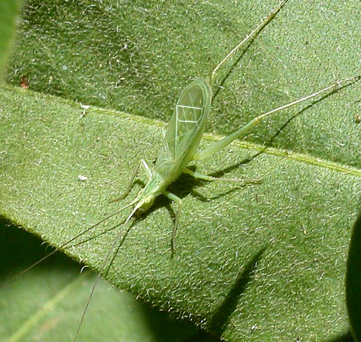

# De krekel als thermometer



Krekels produceren hun kenmerkende tjirp door met hun vleugels langs elkaar te strijken. Het tellen van deze tjirpgeluiden kan gebruikt worden om de temperatuur te schatten. Dit verband werd in 1897 door de natuurkundige Amos Dolbear beschreven: hoe hoger de temperatuur, hoe sneller de krekels tjirpen. De zogenaamde wet van Dolbear geeft een formule om de temperatuur in graden Fahrenheit (F) te schatten op basis van het aantal gehoorde tjirps per minuut $N_{60}$:

$$T_F = 50 + \frac{N_{60} - 40}{4}$$

Deze formule kan ook herschreven worden om de temperatuur in graden Celsius (°C) te bepalen: 

$$T_C = 10 + \frac{N_{60} - 40}{7}$$

## Invoer

Het aantal waargenomen tjirps per minuut $N_{60} \in \mathbb{N}$.

## Uitvoer

Een regel die de temperatuur in graden Fahrenheit aangeeft, en een tweede regel die dezelfde temperatuur weergeeft, uitgedrukt in graden Celsius:
```
temperatuur (Fahrenheit): TF
temperatuur (Celsius): TC
```

## Voorbeeld

**Invoer:**
```
43
```

**Uitvoer:**
```
temperatuur (Fahrenheit): 50.75
temperatuur (Celsius): 10.428571428571429
```