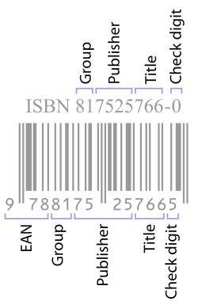

# ISBN-10 nummers

Binnen het ISBN-10 (_International Standard Book Numbering_) systeem dat tot eind 2006 gebruikt werd, kreeg elk boek een unieke code toegewezen die bestaat uit 10 cijfers. De eerste 9 daarvan geven informatie over het boek zelf, terwijl het laatste louter een controlecijfer is dat dient om foutieve ISBN-10 codes te detecteren.

|  |
|:--:|
| ISBN-10 in tekst en streepjescode (Bron afbeelding: [Wikipedia](https://en.wikipedia.org/wiki/ISBN)). |


Als $x_1, \ldots, x_9$ de eerste 9 cijfers van een ISBN-10 code voorstellen, dan wordt het controlecijfer $x_{10}$ als volgt berekend: 
$$x_{10} = (x_1+ 2x_2+ 3x_3+ 4x_4+ 5x_5+ 6x_6+ 7x_7+ 8x_8+
      9x_9)\!\!\!\!\mod{11}$$
Het controlecijfer $x_{10}$ kan dus de waarden 0 tot en met 10 aannemen (om dit in één karakter voor te stellen, wordt het cijfer 10 weergegeven als 'X').

### Opgave

Controleer of een gegeven reeks van 10 cijfers correspondeert met een geldige ISBN-10 code (er worden enkel cijfers ingegeven, je hoeft dus geen rekening te houden met het scenario waarin het controlecijfer 'X' is).

### Invoer

Tien cijfers $x_1, \ldots, x_{10}$ ($0 \leq x_1, \ldots, x_{10} \leq
      9$), elk op een afzonderlijke regel.

### Uitvoer

Het woord OK als de gegeven cijfers overeenkomen met een geldige ISBN-10 code, anders het woord FOUT.

### Voorbeeld 1

**Invoer:**

```
9
9
7
1
5
0
2
1
0
0
```

**Uitvoer:**

```
OK
```

### Voorbeeld 2

**Invoer:**

```
9
9
7
1
5
0
2
1
0
8
```

**Uitvoer:**

```
FOUT
```