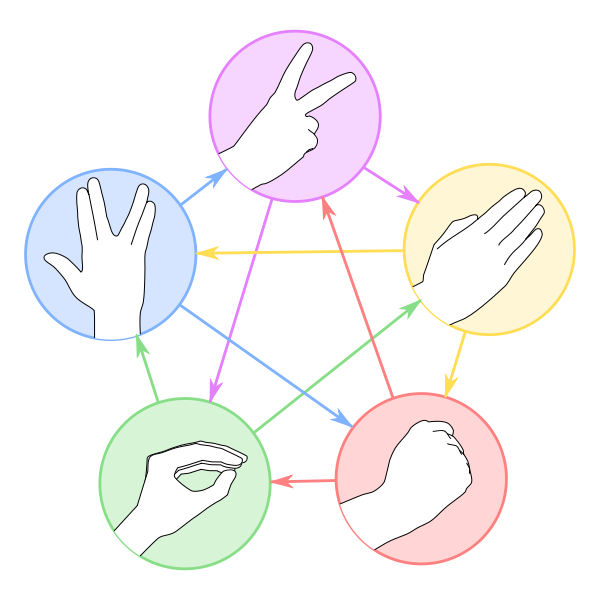

# Blad-steen-hagedis-Spock-schaar 

De meesten onder jullie kennen wellicht het spelletje blad-steen-schaar waarbij twee spelers eerst aftellen en daarna met de hand tegelijkertijd de vorm maken van een steen (een vuist), een schaar (twee uitgestoken vingers) of een blad (een vlakke hand). Hierbij verslaat de steen de schaar, de schaar het blad en het blad de steen. Indien beide spelers dezelfde keuze maken, dan wint geen van beiden.

Sam Kass en Karen Bryla bedachten een uitbreiding van dit klassieke spelletje, en noemden het blad-steen-hagedis-Spock-schaar. Het werkt volgens hetzelfde principe, maar er komen twee extra wapens bij: een hagedis (voorgesteld door met de hand een mond te vormen) en Spock (voorgesteld door de [Vulcaanse groet](http://nl.wikipedia.org/wiki/Vulcaanse_groet) uit de Star Trek reeks te maken). Hierdoor wordt de kans op een gelijkspel kleiner (van 1/3 naar 1/5). 

De regels van blad-steen-hagedis-Spock-schaar zijn:

-   schaar snijdt blad
    
-   blad bedekt steen
    
-   steen plet hagedis
    
-   hagedis vergiftigt Spock
    
-   Spock smelt schaar
    
-   schaar onthoofdt hagedis
    
-   hagedis eet blad
    
-   blad weerlegt Spock
    
-   Spock verdampt steen
    
-   steen breekt schaar
    

Bij een gelijkspel wordt de procedure herhaald totdat er een winnaar is. 

||
|:--:|
|Grafische voorstelling van de regels van het spelletje blad-steen-hagedis-Spock-schaar. Vanaf boven worden in wijzerzin de handgebaren getoond van schaar, blad, steen, hagedis en Spock. 
<sub>Bron afbeelding: [Big Bang Theory Wiki](https://bigbangtheory.fandom.com/wiki/Rock,_Paper,_Scissors,_Lizard,_Spock)</sub>|

### Invoer

Twee regels die elk de naam van een handgebaar bevatten dat respectievelijk door speler1 en speler2 getoond wordt bij een spelletje blad-steen-hagedis-Spock-schaar: blad, steen, hagedis, Spock of schaar.

### Uitvoer

Een regel die aangeeft welke speler het spelletje wint. Deze regel moet één van de volgende omschrijvingen bevatten:

-   gelijkspel
    
-   speler1 wint
    
-   speler2 wint
    

Probeer het aantal voorwaarden dat getest moet worden om de winnaar van het spelletje aan te duiden zo beperkt mogelijk te houden.

### Voorbeeld

**Invoer:**

```
Spock
blad
```

**Uitvoer:**

```
speler2 wint
```