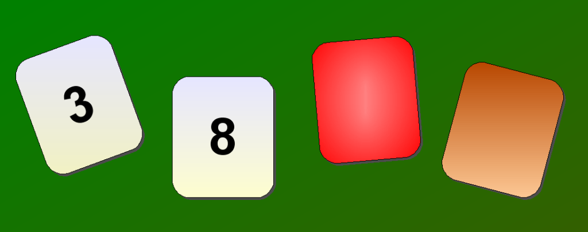

# Het vierkaartenprobleem

Het vierkaartenprobleem (ook gekend als het probleem van de Wason-kaarten) is een logische puzzel die in 1966 bedacht werd door Peter Cathcart Wason. Het is één van de bekendste opdrachten bij het bestuderen van [deductie](http://nl.wikipedia.org/wiki/Deductie). 

De meest gangbare formulering van de puzzel gaat als volgt. Er liggen vier kaarten op een tafel. Elke kaart heeft een getal op één zijde en een kleur op de andere zijde. Welke kaart(en) moet(en) omgedraaid worden om de uitspraak te bevestigen dat als op de ene zijde van een kaart een even getal staat, de andere zijde dan een rode kleur moet hebben?


_Bron afbeelding: [themantic-education.com](https://www.themantic-education.com/ibpsych/2017/10/27/wason-task-studies/)._

Een antwoord is fout als er een kaart aangeduid wordt die niet moest omgedraaid worden, of als er een kaart niet aangeduid wordt die wel moest omgedraaid worden. Het juiste antwoord is dus dat enkel de kaarten met het cijfer 8 en de bruine kleur moeten omgedraaid worden. De uitspraak stelt immers dat "_als_ de kaart een even getal heeft op één zijde, _dan_ moet de andere zijde rood zijn". Een kaart schendt enkel de uitspraak als die zowel een even getal heeft op één zijde en iets anders dan rood op de andere zijde:

-   als de kaart met de 3 rood (of een andere kleur) is, dan wordt de uitspraak niet geschonden
    
-   als de kaart met de 8 niet rood is, dan wordt de uitspraak geschonden
    
-   als de rode kaart een oneven (of even) getal heeft, dan wordt de uitspraak niet geschonden
    
-   als de bruine kaart een even getal heeft, dan wordt de uitspraak geschonden
    
Minder dan 10% van de mensen gaf in het originele onderzoek het juiste antwoord. Een interessante eigenschap van deze puzzel is dat de deelnemers doorgaans geen enkel probleem hebben om de logische oplossing te begrijpen als die wordt uitgelegd en dat ze onmiddellijk akkoord gaan dat de oplossing correct is.

### Invoer

De eerste twee regels van de invoer omschrijven een Wason-kaart. Op de eerste regel staat welke zijde van de kaart naar boven ligt: kleur of waarde. Als de kleurzijde naar boven ligt, dan wordt de kleur omschreven op de tweede regel. Anders bevat de tweede regel een natuurlijk getal. De derde regel bevat ofwel ja of nee als antwoord van een persoon op de vraag of het nodig is om die kaart te draaien om de uitspraak te bevestigen dat als op de ene zijde van een kaart een even getal staat, de andere zijde dan een rode kleur moet hebben.

### Uitvoer

De uitvoer bestaat uit een zin die aangeeft of de persoon het probleem van de Wason-kaarten al dan niet correct heeft opgelost. Leid uit onderstaande voorbeelden de mogelijke formuleringen van deze zin af.

### Voorbeeld 1

**Invoer:**

```
waarde
3
ja
```

**Uitvoer:**

```
Fout: kaarten met waarde 3 moeten niet gedraaid worden.
```

### Voorbeeld 2

**Invoer:**

```
waarde
8
ja
```

**Uitvoer:**

```
Juist: kaarten met waarde 8 moeten gedraaid worden.
```

### Voorbeeld 3

**Invoer:**

```
kleur
rood
nee
```

**Uitvoer:**

```
Juist: kaarten met kleur rood moeten niet gedraaid worden.
```

### Voorbeeld 4

**Invoer:**

```
kleur
bruin
nee
```

**Uitvoer:**

```
Fout: kaarten met kleur bruin moeten gedraaid worden.
```

### Weetjes

Evolutionaire psychologen Leda Cosmides en John Tooby toonden in 1992 aan dat meer deelnemers erin slagen om het juiste antwoord te geven als dezelfde logische puzzel geformuleerd wordt in de context van sociale relaties. Als de uitspraak bijvoorbeeld luidt "Als je alcohol drinkt, dan moet je ouder zijn dan 21 jaar" en de kaarten zijn gelabeld met "27 jaar", "16 jaar", "drinkt cola" en "drinkt bier", dan slaagt 90% van de deelnemers erin om het correcte antwoord te geven ("16 jaar" en "drinkt bier"). Dit lijkt de hypothese te bevestigen dat onze competenties voor het oplossen van dergelijke opdrachten zich ontwikkeld hebben om bedriegers op te sporen in een sociale omgeving.