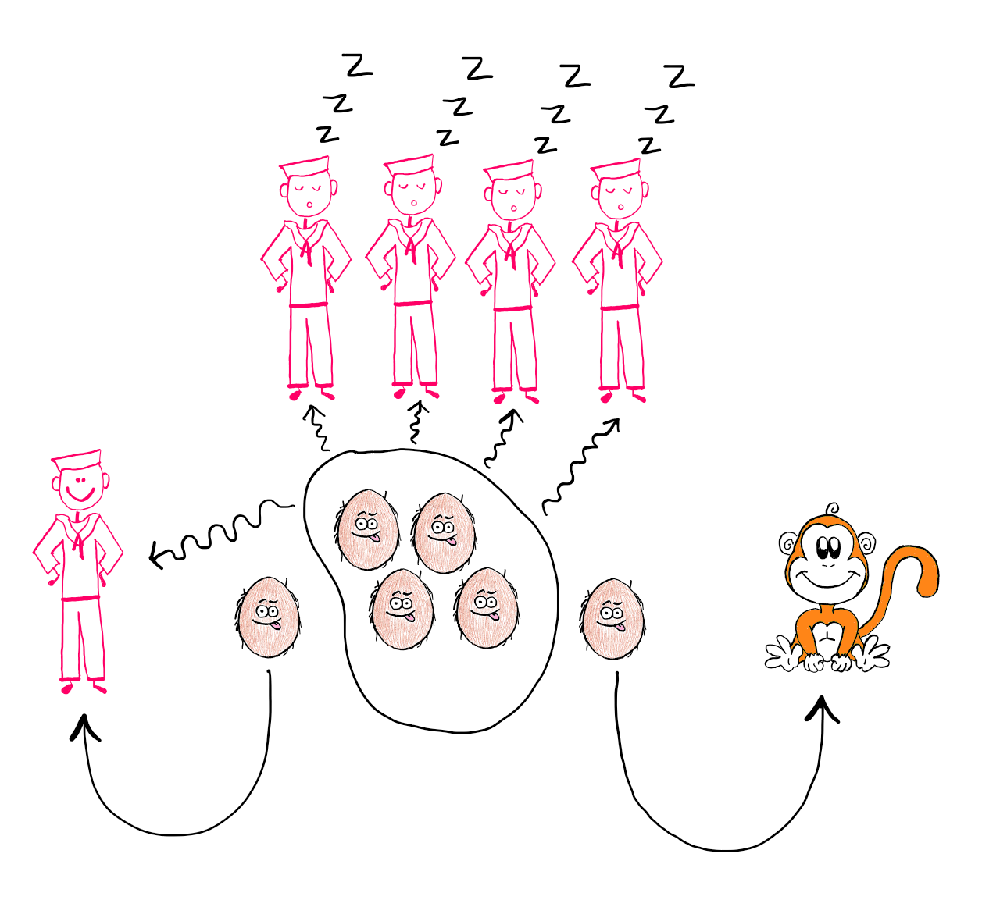

# Piraten-kokosnoten-aap probleem

Vijf piraten lijden schipbreuk en stranden op een onbewoond eiland met één aap en een hoop kokosnoten als voedsel. Ze besluiten dat ze de kokosnoten 's ochtends eerlijk zullen verdelen. 

De piraten vertrouwen elkaar echter niet, ze denken dat ze minder dan hun deel zullen krijgen. 's Nachts staan ze één na één op en doen allemaal hetzelfde: ze nemen één vijfde van de kokosnoten uit de hoop, geven één resterende kokosnoot aan de aap en gaan daarna weer slapen.


<sub>Bron afbeelding: [Hemanth](https://medium.com/street-science/how-to-really-solve-the-monkey-and-the-coconuts-puzzle-e26bcf9c86fc).</sub>

’s Ochtends verdelen ze de resterende kokosnoten een laatste (zesde) keer, maar deze keer blijft er geen enkele kokosnoot over voor de aap.

Hoeveel kokosnoten hadden ze in het begin verzameld?

### Opgave

Het antwoord op bovenstaand raadsel is 3121. Je kan al vooruitkijken naar het eerste voorbeeld hieronder om te controleren dat dit inderdaad het juiste antwoord is. Maar wat als er zes piraten zouden zijn, of zeven, of dertig? Wat is dan het juiste antwoord? In deze opgave controleren we hoe $k$ kokosnoten verdeeld worden onder $p$ piraten, en hoeveel kokosnoten er telkens overblijven voor de aap, als ze de procedure toepassen zoals omschreven in het raadsel uit de inleiding.

### Invoer
Twee regels, met daarop respectievelijk:
- $p$: het aantal piraten 
- $k$: het aantal kokosnoten dat de piraten initieel verzameld hebben

### Uitvoer

Voor elke piraat moet een regel uitgeschreven worden van de vorm:

> _a no(o)t(en)_ = _b no(o)t(en)_ voor piraat#_n_ en _c no(o)t(en)_ voor de aap

ingevuld met de volgende waarden:

-  $a$ is het aantal kokosnoten dat de piraat in de hoop aantreft als hij 's nachts opstaat
    
-  $b$ is het aantal kokosnoten dat de piraat 's nachts verstopt
    
-  $c$ is het aantal kokosnoten dat de piraat 's nachts aan de aap geeft
    
-  $n$ is het volgnummer van de piraat (piraten worden genummerd #1, #2, …)
    

Bij het uitschrijven van een aantal noten moet rekening gehouden worden met de correcte enkelvouds- of meervoudsvorm:

| aantal kokosnoten | wordt uitgeschreven als |
| --- | --- |
| 0 no(o)t(en) | geen noten |
| 1 no(o)t(en) | 1 noot |
| _n_ no(o)t(en) met n≥2 | _n_ noten |

Ten slotte moet ook nog een regel uitgeschreven worden die aangeeft hoe de resterende noten 's morgens verdeeld worden onder de piraten en de aap. Deze regel moet de volgende vorm hebben:

> elke piraat krijgt _d no(o)t(en)_ en _e no(o)t(en)_ voor de aap

ingevuld met de volgende waarden:

-  $d$ is het aantal kokosnoten dat elke piraat 's morgens krijgt
    
-  $e$ is het aantal kokosnoten dat de aap 's morgens krijgt.
    

Bij het uitschrijven van het aantal kokosnoten moet opnieuw rekening gehouden worden met de correcte enkelvouds- of meervoudsvorm, zoals aangegeven in bovenstaande tabel.

### Voorbeeld 1

Dit voorbeeld correspondeert met het antwoord op het raadsel uit de inleiding.

**Invoer:**

```
5
3121
```

**Uitvoer:**

```
3121 noten = 624 noten voor piraat#1 en 1 noot voor de aap
2496 noten = 499 noten voor piraat#2 en 1 noot voor de aap
1996 noten = 399 noten voor piraat#3 en 1 noot voor de aap
1596 noten = 319 noten voor piraat#4 en 1 noot voor de aap
1276 noten = 255 noten voor piraat#5 en 1 noot voor de aap
elke piraat krijgt 204 noten en geen noten voor de aap
```

### Voorbeeld 2

**Invoer:**

```
4
1234
```

**Uitvoer:**

```
1234 noten = 308 noten voor piraat#1 en 2 noten voor de aap
924 noten = 231 noten voor piraat#2 en geen noten voor de aap
693 noten = 173 noten voor piraat#3 en 1 noot voor de aap
519 noten = 129 noten voor piraat#4 en 3 noten voor de aap
elke piraat krijgt 96 noten en 3 noten voor de aap
```

