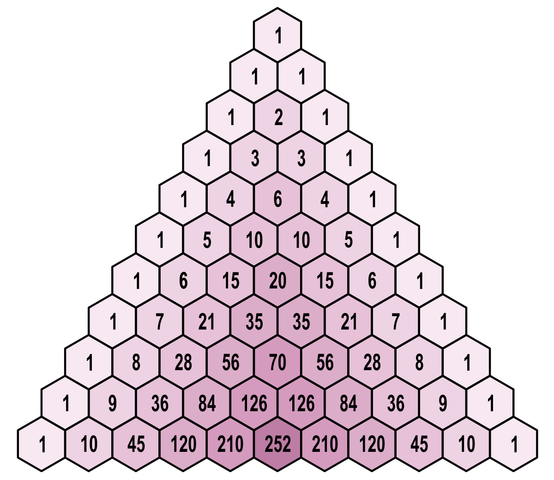
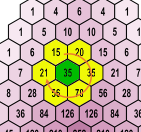

# Een driehoek vol kwadraten

De driehoek van Pascal is een getallenschema dat op de volgende manier wordt opgebouwd: 
- Helemaal bovenaan schrijf je het getal 1. 
- De volgende rij van de driehoek wordt telkens gevormd door op elke positie de som van de twee bovenliggende getallen te schrijven. Indien het getal linksboven of rechtsboven ontbreekt, dan vervang je het door een denkbeeldige nul. Hieronder tonen we alvast hoe de eerste elf rijen van de driehoek opgebouwd worden.

Hieronder is een driehoek van Pascal met elf rijen weergegeven:


<sub>Bron afbeelding: [sphere online judge](https://www.spoj.com/problems/PROG0127/)</sub>

De driehoek van Pascal heeft een aantal bijzondere eigenschappen. Eén van deze eigenschappen is de volgende: 

>In de driehoek van Pascal levert het **product** van de zes getallen rondom een interne positie altijd een **volkomen kwadraat** op.

\
<sub>Bron afbeelding: [sphere online judge](https://www.spoj.com/problems/PROG0127/)</sub>

Als we dit eens uittesten voor het getal 35 op rij 8 en kolom 4 in de driehoek van Pascal, dan vinden we dat

$$15
      \times 20 \times 35 \times 70 \times 56 \times 21 = 864360000 = 29400
      \times 29400$$

### Opgave

Je opdracht bestaat erin te testen of de bovenvermelde eigenschap van de driehoek van Pascal wel degelijk geldt. Om posities in de driehoek van Pascal aan te duiden, nummeren we de rijen van de driehoek van boven naar onder, en nummeren we de kolommen op elke rij van links naar rechts, telkens vanaf 1. 

Gevraagd wordt:

-   Schrijf een functie `driehoek` waaraan een getal $r \in \N$ moet doorgegeven worden. De functie moet de eerste $r$ rijen van de driehoek van Pascal teruggeven, voorgesteld als een lijst met de rijen van boven naar onder. Elke rij wordt zelf ook voorgesteld door een lijst met de getallen op die rij van links naar rechts. Indien het argument dat aan de functie wordt doorgegeven geen natuurlijk getal is, dan moet de functie een `AssertionError` opwerpen met de boodschap `ongeldig aantal rijen`.
    
-   Schrijf een functie `zeshoek` waaraan de rij- en kolomindex van een interne positie in de driehoek van Pascal moet doorgegeven worden. De functie moet een lijst teruggeven met de zes getallen rondom de gegeven interne positie, opgelijst in wijzerzin te beginnen vanaf het getal linksboven de gegeven interne positie.
    
-   Schrijf een functie `kwadraat` waaraan de rij- en kolomindex van een interne positie in de driehoek van Pascal moet doorgegeven worden. De functie moet een string teruggeven van de vorm _factoren_ = _product_ = _wortel_ x _wortel_, waarbij 
    - _factoren_ het uitgeschreven product is van de zes getallen rondom de gegeven interne positie (in dezelfde volgorde zoals die door de functie `zeshoek` worden teruggegeven, met x als de operator voor de vermenigvuldiging), 
    - _product_ het product is van deze zes getallen, en 
    - _wortel_ de vierkantswortel is van dit product dat als natuurlijk getal wordt weergegeven. 

    Bekijk onderstaande voorbeelden om te zien hoe het resultaat precies moet opgemaakt worden.
    

Indien de argumenten die aan de functies `zeshoek` en `kwadraat` worden doorgegeven geen interne positie van de driehoek voorstellen, dan moeten beide functies een `AssertionError` opwerpen met de boodschap `ongeldige interne positie`.

### Voorbeeld

```
>>> driehoek(0)
[]
>>> driehoek(1)
[[1]]
>>> driehoek(2)
[[1], [1, 1]]
>>> driehoek(3)
[[1], [1, 1], [1, 2, 1]]
>>> driehoek(4)
[[1], [1, 1], [1, 2, 1], [1, 3, 3, 1]]
>>> driehoek(5)
[[1], [1, 1], [1, 2, 1], [1, 3, 3, 1], [1, 4, 6, 4, 1]]
>>> driehoek(-1)
Traceback (most recent call last):
AssertionError: ongeldig aantal rijen
>>> driehoek(3.14)
Traceback (most recent call last):
AssertionError: ongeldig aantal rijen

>>> zeshoek(8, 4)
[15, 20, 35, 70, 56, 21]
>>> zeshoek(16, 7)
[2002, 3003, 6435, 11440, 8008, 3003]
>>> zeshoek(3, 3)
Traceback (most recent call last):
AssertionError: ongeldige interne positie

>>> kwadraat(8, 4)
'15 x 20 x 35 x 70 x 56 x 21 = 864360000 = 29400 x 29400'
>>> kwadraat(16, 7)
'2002 x 3003 x 6435 x 11440 x 8008 x 3003 = 10643228293383247161600 = 103166022960 x 103166022960'
>>> kwadraat(3, 3)
Traceback (most recent call last):
AssertionError: ongeldige interne positie
```