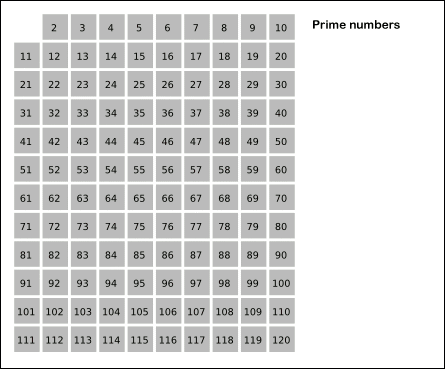

# Zeef van Eratosthenes

De **zeef van Eratosthenes** is een algoritme dat dateert van circa 240 voor Christus. Het kan gebruikt worden om priemgetallen op te lijsten en is daarmee één van de oudste methoden van zijn soort. Deze elegante methode is vooral efficiënt wanneer ze wordt gebruikt voor kleinere priemgetallen. De methode vergt echter het bijhouden van een lijst met alle getallen die kleiner zijn of gelijk aan een vooraf vastgelegde bovengrens $n$. Dit wordt een steeds groter nadeel naarmate de te bepalen priemgetallen groter worden.

||
|:--:|
|Demonstratie van de methode met de zeef van Eratosthenes voor het vinden van alle priemgetallen die kleiner of gelijk zijn aan 120. Bron afbeelding: [SKopp voor Wikipedia](https://en.wikipedia.org/wiki/File:Sieve_of_Eratosthenes_animation.gif).|

De methode om de lijst van priemgetallen te vinden die kleiner zijn of gelijk aan een vooraf opgegeven getal $n$, werkt als volgt:

1.  maak een lijst van alle getallen van 2 tot en met $n$ 
    
2.  bepaal $m$ als het kleinste getal uit de lijst
    
3.  doorstreep in de lijst alle veelvouden van $m$, zonder daarbij $m$ zelf te doorstrepen
    
4.  bepaal $m$ als het volgende getal uit de lijst

5.  ga verder vanaf stap 3, of stop indien er geen volgend getal $m$ meer kan bepaald worden
    
De getallen die uiteindelijk niet doorstreept werden, zijn alle priemgetallen die kleiner zijn of gelijk aan $n$. Deze procedure kan nog op enkele manieren versneld worden:

-   het heeft geen zin om in stap 4 een getal te kiezen dat al doorstreept is, want alle veelvouden daarvan zijn reeds doorstreept in voorgaande stappen
    
-   men kan met het doorstrepen van de veelvouden van $m$ beginnen vanaf $m^2$. Alle kleinere veelvouden zijn reeds doorstreept in voorgaande stappen
    
-   als $m^2$ groter is dan $n$, dan kan de procedure gestopt worden
    

We verduidelijken bovenstaande procedure met een voorbeeld, waarbij we de priemgetallen zoeken die kleiner zijn of gelijk aan $n=30$. Daarvoor beginnen we met een lijst van 2 tot en met 30.

> 2 3 4 5 6 7 8 9 10 11 12 13 14 15 16 17 18 19 20 21 22 23 24 25 26 27 28 29 30

In de eerste ronde strepen we de veelvouden van $m=2$ weg, te beginnen met $2^2 = 4$.

> **2** 3 <s>4</s> 5 <s>6</s> 7 <s>8</s> 9 <s>10</s> 11 <s>12</s> 13 <s>14</s> 15 <s>16</s> 17 <s>18</s> 19 <s>20</s> 21 <s>22</s> 23 <s>24</s> 25 <s>26</s> 27 <s>28</s> 29 <s>30</s>

Daarna gaan we verder met het schappen van de veelvouden van $m = 3$, te beginnen bij $3^2 = 9$. Elementen die in deze stap geschrapt worden, staan in het vet.

> 2 **3** <s>4</s> 5 <s>6</s> 7 <s>8</s> **<s>9</s>** <s>10</s> 11 <s>12</s> 13 <s>14</s> **<s>15</s>** <s>16</s> 17 <s>18</s> 19 <s>20</s> **<s>21</s>** <s>22</s> 23 <s>24</s> 25 <s>26</s> **<s>27</s>** <s>28</s> 29 <s>30</s>

Het getal $4$ is al doorstreept. We gaan dus verder met het schappen van de veelvouden van $5$, te beginnen bij $5^2 = 25$.

> 2 3 <s>4</s> **5** <s>6</s> 7 <s>8</s> <s>9</s> <s>10</s> 11 <s>12</s> 13 <s>14</s> <s>15</s> <s>16</s> 17 <s>18</s> 19 <s>20</s> <s>21</s> <s>22</s> 23 <s>24</s> **<s>25</s>** <s>26</s> <s>27</s> <s>28</s> 29 <s>30</s>

Het volgende getal dat nog niet geschrapt werd, is $7$. We zouden nu dus de veelvouden van $7$ moeten wegstrepen, te beginnen met $7^2 = 49$. Dit kwadraat is echter groter dan $30$ en dus kunnen we de procedure hier stoppen. Wat we overhouden zijn de priemgetallen die kleiner zijn of gelijk aan $n = 30$.

> 2 3 <s>4</s> 5 <s>6</s> 7 <s>8</s> <s>9</s> <s>10</s> 11 <s>12</s> 13 <s>14</s> <s>15</s> <s>16</s> 17 <s>18</s> 19 <s>20</s> <s>21</s> <s>22</s> 23 <s>24</s> <s>25</s> <s>26</s> <s>27</s> <s>28</s> 29 <s>30</s>

### Opgave

Schrijf een functie `zeef` waaraan een getal $n \in \N$ moet doorgegeven worden. Deze functie moet een gesorteerde lijst teruggeven die alle priemgetallen bevat die kleiner dan of gelijk zijn aan $n$. Hiervoor moet de functie de zeef van Eratosthenes implementeren, inclusief de optimalisatie om de procedure van het schrappen te versnellen.

### Voorbeeld

```
>>> zeef(6)
[2, 3, 5]
>>> zeef(30)
[2, 3, 5, 7, 11, 13, 17, 19, 23, 29]
>>> zeef(100) 
[2, 3, 5, 7, 11, 13, 17, 19, 23, 29, 31, 37, 41, 43, 47, 53, 59, 61, 67, 71, 73, 79, 83, 89, 97]
```