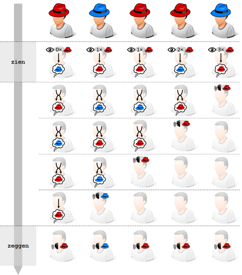

# Achterhoede

Honderd personen staan achter elkaar in een rij, en kijken allemaal in dezelfde richting. Er worden willekeurig rode en blauwe hoeden op de hoofden van deze personen gezet. Elke persoon kan alle hoeden voor hem zien, maar niet zijn eigen hoed of deze achter hem. Te beginnen achteraan de rij, moet elke persoon om de beurt raden welke kleur van hoed hij op zijn hoofd heeft. Elke persoon kan alle kleuren horen die de personen achter hem raden. Als de groep personen op voorhand mag overleggen over een strategie, hoeveel personen kunnen dan gegarandeerd de juiste kleur raden van de hoed op hun eigen hoofd?

Het antwoord is verrassend genoeg 99 — de eerste gok kan verkeerd zijn, maar alle anderen kunnen de juiste kleur raden. De strategie die hiervoor moet gebruikt worden bestaat uit twee stappen.

Alvorens de persoon achteraan de rij begint te raden, telt elke persoon het aantal rode hoeden die hij voor zich ziet. Als het aantal rode hoeden oneven is, dan houdt hij de kleur rood in zijn hoofd. Als het aantal rode hoeden even is (inclusief 0), dan houdt hij de kleur blauw in zijn hoofd.

Daarna luistert elke persoon naar de kleuren die achter hem geraden worden, totdat het zijn eigen beurt is om de kleur van zijn hoed te raden. Elke keer hij de kleur rood hoort, wisselt hij de kleur die hij in zijn hoofd hield (rood wordt blauw, en omgekeerd). Als hij aan de beurt komt om een kleur te raden, zegt hij de kleur die hij op dat moment in zijn hoofd houdt.


<sub>Bron afbeelding: [Dodona - Achterhoede](https://dodona.be/nl/activities/1067717366/)</sub>

Bovendien werkt deze strategie ongeacht het aantal personen in de rij. Bovenstaande figuur illustreert dit met een voorbeeld waarbij er slechts vijf personen in de rij staan. Eerst telt elke persoon het aantal rode hoeden die hij voor zich ziet. De eerste persoon ziet geen rode hoeden, de tweede en derde persoon zien er elk één, de vierde persoon ziet er twee en de laatste persoon ziet er drie. De eerste en vierde persoon zien een even aantal rode hoeden, en houden dus de kleur blauw in hun hoofd. De overige personen houden de kleur rood in hun hoofd omdat ze een oneven aantal rode hoeden zien.

Daarna komt de persoon achteraan de rij als eerste aan de beurt om de kleur van zijn hoed te raden. Omdat hij de kleur rood in zijn hoofd heeft, zegt hij deze kleur luidop (en maakt daarmee de verkeerde keuze). De eerste vier personen horen de kleur rood, en wisselen de kleur die ze in hun hoofd hielden. De voorlaatste persoon heeft nu de kleur rood in zijn hoofd, en is als volgende aan de beurt om deze kleur luidop te zeggen. Omdat de eerst drie personen opnieuw de kleur rood achter zich horen zeggen, wisselen ze terug de kleur die ze in hun hoofd hielden. Dit gaat zo verder totdat uiteindelijk de eerste persoon uit de rij de kleur zegt die hij op dat moment in zijn hoofd heeft.

### Opgave

In deze opgave stellen we de kleuren rood en blauw respectievelijk voor door de letters R en B. Een rij van personen die elk een geassocieerde kleur hebben (hetzij de kleur van de hoed op hun hoofd, hetzij een kleur die ze in hun hoofd houden) wordt voorgesteld door een reeks (een lijst, een tuple of een string) letters. Gevraagd wordt om de volgende twee functies te schrijven, die een implementatie vormen van de eerste en de tweede stap uit de strategie die in de inleiding werd uiteengezet.

-   Schrijf een functie `zien` waaraan een rij van personen moet doorgegeven worden, die elk een rode of een blauwe hoed op hun hoofd hebben. De functie moet een tuple teruggeven, dat de kleuren bevat die de personen uit de gegeven rij in hun hoofd houden op basis van het aantal rode hoeden die ze voor zich zien in de rij. Een oneven aantal rode hoeden correspondeert met de kleur rood, en een even aantal rode hoeden (inclusief 0) correspondeert met de kleur blauw.
    
-   Schrijf een functie `zeggen` waaraan een rij van personen moet doorgegeven worden, die elk een kleur (rood of blauw) in hun hoofd houden, zijnde de kleur die ze bepaald hebben op basis van het aantal rode hoeden die ze voor zich zien. De functie moet een tuple teruggeven, dat de kleuren bevat die de personen uiteindelijk zullen zeggen als ze de tweede stap uit de strategie volgen die in de inleiding wordt uiteengezet.

### Voorbeeld

```
>>> zien(('R', 'B', 'R', 'R', 'B'))
('B', 'R', 'R', 'B', 'R')
>>> zeggen(('B', 'R', 'R', 'B', 'R'))
('R', 'B', 'R', 'R', 'R')

>>> zien(['R', 'R', 'B', 'R', 'R', 'B', 'R', 'B', 'R', 'R'])
('B', 'R', 'B', 'B', 'R', 'B', 'B', 'R', 'R', 'B')
>>> zeggen(['B', 'R', 'B', 'B', 'R', 'B', 'B', 'R', 'R', 'B'])
('R', 'R', 'B', 'R', 'R', 'B', 'R', 'B', 'R', 'B')

>>> zien('BBRBRBRBBRBR')
('B', 'B', 'B', 'R', 'R', 'B', 'B', 'R', 'R', 'R', 'B', 'B')
>>> zeggen('BBRBRBRBBRBB')
('B', 'R', 'R', 'R', 'R', 'R', 'R', 'B', 'R', 'R', 'B', 'B')
```

Merk op dat de eerste twee testgevallen corresponderen met het voorbeeld dat in de inleiding werd besproken.