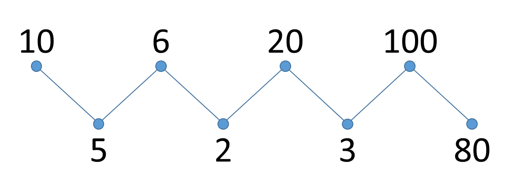

# Zigzag
<sub>Bron oefening en afbeeldingen: [Dodona - Zigzag](https://dodona.be/nl/activities/2038783829/).</sub>

Een reeks getallen $a_0, a_1, a_2, a_3, a_4, \ldots$ wordt **zigzag-gesorteerd** genoemd als geldt dat 

$$a_0 \geq a_1 \leq a_2 \geq a_3 \leq a_4 \geq
      \ldots$$

Met andere woorden, de getallen zijn afwisselend groter en kleiner: het eerste is groter dan of gelijk aan het tweede, het tweede kleiner dan of gelijk aan het derde, het derde groter dan of gelijk aan het vierde, enz. Dit is bijvoorbeeld het geval voor de volgende reeks getallen:



Een eenvoudige manier om een gegeven reeks getallen te herschikken zodat ze zigzag-gesorteerd is, bestaat erin de getallen eerst van klein naar groot te sorteren, en daarna elk niet-overlappend paar opeenvolgende getallen om te wisselen. Stel bijvoorbeeld dat we vertrekken van de reeks [10, 90, 49, 2, 1, 5, 23]. Na het sorteren bekomen we de reeks [1, 2, 5, 10, 23, 49, 90]. Na het omwisselen van naburige getallen bekomen we de reeks [2, 1, 10, 5, 49, 23, 90].

")

Er bestaat echter ook een snellere manier om een gegeven reeks getallen te zigzag-sorteren. Deze manier is gebaseerd op het feit dat als we ervoor zorgen dat alle getallen op een even positie in de reeks (met index 0, 2, 4, …) groter of gelijk zijn dan hun buren, we ons verder geen zorgen meer hoeven te maken over de getallen op de oneven posities. Het volstaat dus om alle even posities van de reeks van links naar rechts te overlopen, en voor elke even positie de volgende twee stappen na elkaar uit te voeren

1.  als het huidige element op de even positie kleiner is dan het element op de **voorgaande** oneven positie (indien die er is), wissel deze twee elementen dan om
    
2.  als het huidige element op de even positie kleiner is dan het element op de **volgende** oneven positie (indien die er is), wissel deze twee elementen dan om
    

Toegepast op bovenstaand voorbeeld wordt dit

")

### Opgave

-   Schrijf een functie `iszigzag` waaraan een reeks (list of tuple) van gehele getallen (int) moet doorgegeven worden. De functie moet een Booleaanse waarde (bool) teruggeven die aangeeft of de gegeven reeks getallen zigzag-gesorteerd is.
    
-   Schrijf een functie `zigzag_traag` waaraan een lijst (list) van gehele getallen (int) moet doorgegeven worden. De functie moet de gegeven lijst van getallen zigzag-sorteren op basis van de **trage methode** die hierboven werd omschreven. De functie moet geen resultaat teruggeven (lees: moet de waarde None teruggeven), maar moet de gegeven lijst _in place_ bijwerken.
    
-   Schrijf een functie `zigzag_snel` waaraan een lijst (list) van gehele getallen (int) moet doorgegeven worden. De functie moet de gegeven lijst van getallen zigzag-sorteren op basis van de **snelle methode** die hierboven werd omschreven. De functie moet geen resultaat teruggeven (lees: moet de waarde None teruggeven), maar moet de gegeven lijst _in place_ bijwerken.
    

### Voorbeeld

```
>>> iszigzag([10, 5, 6, 3, 2, 20, 100, 80])
False
>>> iszigzag((10, 5, 6, 2, 20, 3, 100, 80))
True
>>> iszigzag([20, 5, 10, 2, 80, 6, 100, 3])
True

>>> reeks = [10, 90, 49, 2, 1, 5, 23]
>>> zigzag_traag(reeks)
>>> reeks
[2, 1, 10, 5, 49, 23, 90]

>>> reeks = [10, 90, 49, 2, 1, 5, 23]
>>> zigzag_snel(reeks)
>>> reeks
[90, 10, 49, 1, 5, 2, 23]

```