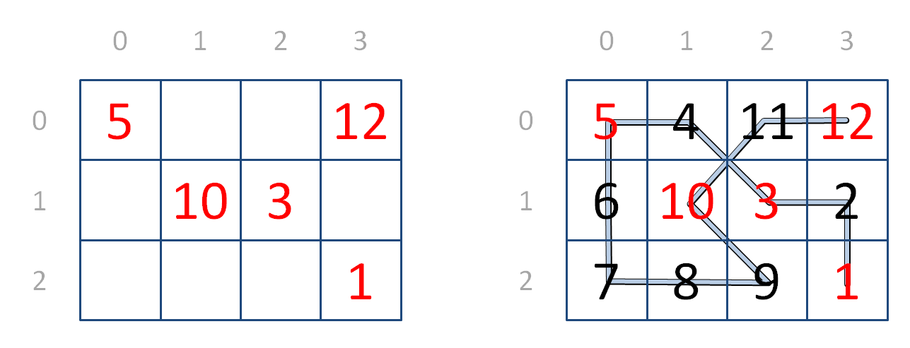

# Hidato
<sub>Bron oefening en afbeelding: [Dodona - Hidato](https://dodona.be/nl/activities/565313929/).</sub>

De term hidato is afgeleid van het Hebreeuwse woord voor raadsel (hida, חידאתו) en is de naam van een puzzel uitgevonden door Gyora Benedek, een Israëlische informaticus, uitvinder en avonturier.

De opgave van een hidato bestaat uit een rechthoekig rooster met $m$ rijen en $n$ kolommen. De oplossing bestaat erin de reeks natuurlijke getallen van 1 tot en met $m \cdot n$ in het rooster in te vullen, zodat opeenvolgende getallen horizontaal, verticaal of diagonaal naast elkaar staan. De opgave van de puzzel bevat reeds de posities van de getallen 1 en $m \cdot n$. Daarnaast worden in het gegeven rooster ook al een aantal andere getallen ingevuld, om de speler op weg te helpen bij het vinden van de oplossing en om te verzekeren dat de hidato een unieke oplossing heeft.

||
|:--:|
|Een hidato (links) en zijn oplossing (rechts).|

In deze opgave stellen we een $m \cdot n$ rooster met de oplossing van een hidato voor als lijst met $m$ elementen. Deze elementen stellen de rijen van het rooster voor. Elke rij is zelf ook een lijst met $n$ natuurlijke getallen. Deze stellen de getallen voor die ingevuld zijn op de opeenvolgende kolommen van de rij. Je mag ervan uitgaan dat elk van de getallen 1, 2, …, $m \cdot n$ juist één keer voorkomt in het rooster. De rijen van het rooster worden van boven naar onder genummerd, en de kolommen van links naar rechts. Het nummeren van de rijen en de kolommen start vanaf 0. Gevraagd wordt om te bepalen of een gegeven rooster een geldige oplossing van een hidato voorstelt. Hiervoor ga je als volgt te werk:

 
- Schrijf een functie `eerste` waaraan de oplossing van een
          hidato moet doorgegeven worden. De functie moet een tuple (r, k) teruggeven dat het rijnummer $r$ en het kolomnummer
          $k$ bevat van de cel in het rooster die de waarde 1 bevat.
      
      
- Schrijf een functie `opvolger` waaraan drie argumenten
          moeten doorgegeven worden. Het eerste argument is de oplossing van een
          hidato. Het tweede en derde argument stellen respectievelijk het rij-
          en kolomnummer van een cel in het rooster voor. De functie moet een
          tuple (r, k) teruggeven dat het rijnummer $r$ en het
          kolomnummer $k$ bevat van de cel in het rooster die volgt op de
          gegeven cel. Als de gegeven cel het natuurlijke getal $v$ bevat, dan
          is de opvolger de cel die horizontaal, verticaal of diagonaal raakt
          aan de gegeven cel en de waarde $v + 1$ bevat. Indien de gegeven cel
          geen opvolger heeft, dan moet de functie het tuple (None, None)
          teruggeven.
      
      
- Gebruik de functies `eerste` en `opvolger` om
          een functie `laatste` te schrijven waaraan de oplossing
          van een hidato moet doorgegeven worden. De functie moet een tuple (r,
            k) teruggeven dat het rijnummer $r$ en het kolomnummer
          $k$ bevat van de cel in het rooster die bekomen wordt door te
          vertrekken vanaf de cel die de waarde 1 bevat, en telkens de volgende
          cel te bepalen totdat een cel bereikt wordt die geen opvolger meer
          heeft. De coördinaten van deze laatste cel moeten door de functie
          teruggegeven worden.
      
      
- Gebruik de functie `laatste` om een functie `hidato`
          te schrijven waaraan de oplossing van een hidato moet doorgegeven
          worden. De functie moet een Booleaanse waarde teruggeven, die aangeeft
          of het gegeven rooster een geldige oplossing van een hidato voorstelt.
          Dit kan bepaald worden door te vertrekken vanaf de cel die de waarde 1
          bevat, en telkens de volgende cel te bepalen totdat een cel bereikt
          wordt die geen opvolger meer heeft. Indien deze laatste cel een getal
          bevat dat gelijk is aan het aantal cellen van het rooster, dan stelt
          het gegeven rooster een geldige oplossing van een hidato voor.
      
### Voorbeeld

```
>>> eerste([[5, 4, 11, 12], [6, 10, 3, 2], [7, 8, 9, 1]])
(2, 3)
>>> eerste([[8, 14, 13, 12], [15, 1, 2, 11], [5, 3, 10, 16], [4, 6, 7, 9]])
(1, 1)
>>> eerste(((18, 19, 20, 4, 5), (17, 1, 3, 6, 8), (16, 13, 2, 9, 7), (14, 15, 12, 11, 10)))
(1, 1)

>>> opvolger([[5, 4, 11, 12], [6, 10, 3, 2], [7, 8, 9, 1]], 2, 3)
(1, 3)
>>> opvolger([[5, 4, 11, 12], [6, 10, 3, 2], [7, 8, 9, 1]], 1, 3)
(1, 2)
>>> opvolger([[5, 4, 11, 2], [6, 10, 3, 12], [7, 8, 9, 1]], 2, 3)
(None, None)

>>> laatste([[5, 4, 11, 12], [6, 10, 3, 2], [7, 8, 9, 1]])
(0, 3)
>>> laatste([[8, 14, 13, 12], [15, 1, 2, 11], [5, 3, 10, 16], [4, 6, 7, 9]])
(3, 2)
>>> laatste(((18, 19, 20, 4, 5), (17, 1, 3, 6, 8), (16, 13, 2, 9, 7), (14, 15, 12, 11, 10)))
(0, 2)

>>> hidato([[5, 4, 11, 12], [6, 10, 3, 2], [7, 8, 9, 1]])
True
>>> hidato([[8, 14, 13, 12], [15, 1, 2, 11], [5, 3, 10, 16], [4, 6, 7, 9]])
False
>>> hidato(((18, 19, 20, 4, 5), (17, 1, 3, 6, 8), (16, 13, 2, 9, 7), (14, 15, 12, 11, 10)))
True
```