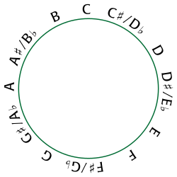

# Akkoorden

Een akkoord is een samenklank van drie of meer noten die samen één klank vormen. In de muziek wordt een akkoord vaak kort genoteerd, zoals ‘Gm7’, wat verwijst naar een specifieke combinatie van noten.

||
|:--:|
|Een G-majeurakkoord op gitaar.|

De twaalf tonen van de chromatische toonladder zijn:

> C C# D D# E F F# G G# A A# B

Elke stap tussen tonen is een halve toon, en de toonladder wordt cyclisch herhaald.
||
|:--:|
|Chromatische schaal getekend als een cirkel: elke noot staat op dezelfde afstand van zijn buren, en is ervan gescheiden door een halve toon van dezelfde grootte. Bron afbeelding: [David Eppstein](https://commons.wikimedia.org/wiki/File:Pitch_class_space.svg).|

Verschillende akkoordtypes worden aangeduid met symbolen en corresponderende toonintervallen:

| akkoordtype       | symbool | toonintervallen  |
|-------------------|---------|------------------|
| majeur            | (leeg)  | [0, 4, 7]        |
| mineur            | m       | [0, 3, 7]        |
| dominant septiem  | 7       | [0, 4, 7, 10]    |
| mineur septiem    | m7      | [0, 3, 7, 10]    |
| majeur septiem    | M7      | [0, 4, 7, 11]    |

Een akkoord wordt opgebouwd door vanuit de grondnoot toonintervallen te tellen in de chromatische toonladder. Bijvoorbeeld: Gm7 (grondnoot G, intervals [0,3,7,10]) bestaat uit de tonen [G+0, G+3, G+7, G+10] → [G, A#, D, F].

### Opgave

- Schrijf een functie `ontleding` die de verkorte akkoordnotatie (= argument) splitst in grondnoot en akkoordtype (majeur als lege string) en deze teruggeeft als **tuple**.
- Schrijf een functie `noten` die vanuit een grondnoot en een lijst van toonintervallen berekent uit welke noten het akkoord bestaat en deze als **lijst** teruggeeft.
- Schrijf een functie `akkoord` waarin je bovenstaande functies gebruikt. Aan deze
          functie moeten drie argumenten doorgegeven worden: 
    1.  een
          string met de verkorte akkoordnotatie
    2. een
          dictionary die de namen van een aantal verschillende types akkoorden
          afbeeldt op de corresponderende lijst van toonintervallen (zie voorbeeld)
    3. een dictionary die de symbolische voorstelling van alle types
          akkoorden uit het tweede argument afbeeldt op hun naam (zie voorbeeld). 

    De functie moet
          een **tuple** teruggeven dat de
          noten uit de chromatische toonladder bevat waaruit het akkoord is
          opgebouwd. 

### Voorbeeld

```
>>> ontleding('F')
('F', '')
>>> ontleding('Gm7')
('G', 'm7')
>>> ontleding('D#M7')
('D#', 'M7')

>>> noten('F', [0, 4, 7])
['F', 'A', 'C']
>>> noten('G', [0, 3, 7, 10])
['G', 'A#', 'D', 'F']
>>> noten('D#', [0, 4, 7, 11])
['D#', 'G', 'A#', 'D']

>>> akkoordtypes = {'majeur':[0, 4, 7], 'mineur':[0, 3, 7], 'dominant septiem':[0, 4, 7, 10], 'mineur septiem':[0, 3, 7, 10], 'majeur septiem':[0, 4, 7, 11]}
>>> akkoordsymbolen = {'':'majeur', 'm':'mineur', '7':'dominant septiem', 'm7':'mineur septiem', 'M7':'majeur septiem'}
>>> akkoord('F', akkoordtypes, akkoordsymbolen)
('F', 'A', 'C')
>>> akkoord('Gm7', akkoordtypes, akkoordsymbolen)
('G', 'A#', 'D', 'F')
>>> akkoord('D#M7', akkoordtypes, akkoordsymbolen)
('D#', 'G', 'A#', 'D')
```