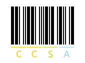

# Code 39

[Code 39](https://nl.wikipedia.org/wiki/Code_39) is een techniek voor het opstellen van barcodes. Bij code 39 wordt elk karakter voorgesteld door vijf verticale zwarte stroken, die van elkaar gescheiden worden door vier verticale witte stroken. Drie van de negen stroken zijn breed en de andere zes zijn smal. Barcodes van opeenvolgende karakters worden steeds van elkaar gescheiden door een smalle witte strook. Hieronder zie je bijvoorbeeld hoe CCSA eruit ziet als code 39 barcode.



Code 39 barcodes worden in ASCII-formaat voorgesteld aan de hand van vier symbolen, die de vier combinaties van smalle/brede zwarte/witte banden voorstellen.

| strook | symbool |
| --- | --- |
| breed-zwart | B |
| smal-zwart | S |
| breed-wit | b |
| smal-wit | s |

Zo is BsSsSbSsB bijvoorbeeld de ASCII-voorstelling van de letter A in code 39.

### Opgave

Een **codeersleutel** is een dictionary (dict) die karakters (str) afbeeldt op hun ASCII-voorstelling in code 39 (str). Daarbij heeft elk karakter in code 39 een unieke voorstelling (voorgesteld als een string van lengte 9). Omdat code 39 geen onderscheid maakt tussen hoofdletters en kleine letters, gebruiken codeersleutels nooit kleine letters als sleutel.

Gevraagd wordt:

-   Schrijf een functie `omgekeerd` waaraan een dictionary (dict) moet doorgegeven worden. De functie moet een nieuwe dictionary (dict) teruggeven die dezelfde sleutel/waarde paren bevat als de gegeven dictionary, maar waarbij de rollen van sleutels en waarden omgekeerd werden. Hierbij mag de functie ervan uitgaan dat alle waarden van de gegeven dictionary uniek en onveranderlijk zijn.
    
-   Schrijf een functie `code39` waaraan twee argumenten moeten doorgegeven worden: 
    1. een zin (str) 
    2. een codeersleutel (dict). 
    
    De functie moet de ASCII-voorstelling (str) van de gegeven zin als code 39 teruggeven, waarbij gebruikgemaakt wordt van de gegeven codeersleutel. Bij de omzetting naar code 39 mag geen onderscheid gemaakt worden tussen hoofdletters en kleine letters. Daarnaast mag de functie er wel van uitgaan dat elk karakter in de zin als sleutel voorkomt in de gegeven codeersleutel.
    
    #### Opmerking
    
    Onthoud dat de omzettingen van opeenvolgende karakters van de zin steeds van elkaar moeten gescheiden worden door een smalle witte strook (voorgesteld door de letter s).
    
-   Schrijf een functie `decode39` waaraan twee argumenten moeten doorgegeven worden: 
    1. de ASCII-voorstelling (str) van een zin in code 39 en 
    2. de codeersleutel (dict) die gebruikt werd voor de omzetting naar code 39. 

    De functie moet de originele zin (str) teruggeven, waarbij alle letters in hoofdletters worden weergegeven.
    

### Voorbeeld

```
>>> sleutel = {
...     'U': 'SbSbSbSsS', 'Z': 'SsBsSbBsS', 'P': 'BbSsSsBsS', 'R': 'SsSbBsBsS',
...     'H': 'SsBbBsSsS', 'W': 'SbBsSsBsS', 'D': 'SbBsSsSsB', 'K': 'BsSsSsBbS',
...     '-': 'SsSbBsSsB', 'M': 'SbSsSbSbS', 'O': 'SsSbSsBsB', '7': 'SsSbSbSbS',
...     '+': 'BsSsBbSsS', '1': 'SsSsBbBsS', ' ': 'SsBsBbSsS', '.': 'SsBbSsBsS',
...     '/': 'SsSsBsBbS', 'V': 'SbSsBsBsS', 'X': 'SbSbSsSbS', 'C': 'SbSsBsSsB',
...     'Y': 'BsSsSbBsS', 'G': 'BsBsSsSbS', '4': 'SsBbSsSsB', 'Q': 'SsBsSbSsB',
...     'J': 'SsSsSsBbB', 'F': 'BsSsSbSsB', 'A': 'SsBsSsSbB', '6': 'BsSsSsSbB',
...     '2': 'BsBsSbSsS', '$': 'SsSsSbBsB', '0': 'BsSbBsSsS', 'N': 'SsBsBsSbS',
...     'I': 'BsSbSsSsB', '9': 'BbSsBsSsS', 'L': 'BsSbSsBsS', ',': 'SsSsBsSbB',
...     '5': 'BsSsBsSbS', 'B': 'BbBsSsSsS', '%': 'SsBsSsBbS', 'S': 'BsBbSsSsS',
...     '3': 'SbBsBsSsS', 'T': 'BbSsSsSsB', '*': 'SsSsBbSsB', 'E': 'SbSsSsBsB'
... }
>>> omgekeerd(sleutel)
{'SbSbSbSsS': 'U', 'SsBsSbBsS': 'Z', 'BbSsSsBsS': 'P', 'SsSbBsBsS': 'R', 'SsBbBsSsS': 'H', 'SbBsSsBsS': 'W', 'SbBsSsSsB': 'D', 'BsSsSsBbS': 'K', 'SsSbBsSsB': '-', 'SbSsSbSbS': 'M', 'SsSbSsBsB': 'O', 'SsSbSbSbS': '7', 'BsSsBbSsS': '+', 'SsSsBbBsS': '1', 'SsBsBbSsS': ' ', 'SsBbSsBsS': '.', 'SsSsBsBbS': '/', 'SbSsBsBsS': 'V', 'SbSbSsSbS': 'X', 'SbSsBsSsB': 'C', 'BsSsSbBsS': 'Y', 'BsBsSsSbS': 'G', 'SsBbSsSsB': '4', 'SsBsSbSsB': 'Q', 'SsSsSsBbB': 'J', 'BsSsSbSsB': 'F', 'SsBsSsSbB': 'A', 'BsSsSsSbB': '6', 'BsBsSbSsS': '2', 'SsSsSbBsB': '$', 'BsSbBsSsS': '0', 'SsBsBsSbS': 'N', 'BsSbSsSsB': 'I', 'BbSsBsSsS': '9', 'BsSbSsBsS': 'L', 'SsSsBsSbB': ',', 'BsSsBsSbS': '5', 'BbBsSsSsS': 'B', 'SsBsSsBbS': '%', 'BsBbSsSsS': 'S', 'SbBsBsSsS': '3', 'BbSsSsSsB': 'T', 'SsSsBbSsB': '*', 'SbSsSsBsB': 'E'}
>>> gecodeerd = code39('Sulfur, so good.', sleutel)
>>> gecodeerd
'BsBbSsSsSsSbSbSbSsSsBsSbSsBsSsBsSsSbSsBsSbSbSbSsSsSsSbBsBsSsSsSsBsSbBsSsBsBbSsSsBsBbSsSsSsSsSbSsBsBsSsBsBbSsSsBsBsSsSbSsSsSbSsBsBsSsSbSsBsBsSbBsSsSsBsSsBbSsBsS'
>>> decode39(gecodeerd, sleutel)
'SULFUR, SO GOOD.'

```