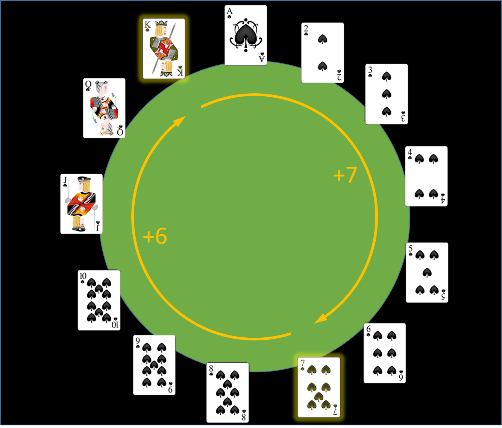

# De vijfde kaart
<sub>Bron oefening en afbeelding: [Dodona - De vijfde kaart](https://dodona.be/nl/activities/1162195102/).</sub>

Ken je deze goocheltruc al? Een toeschouwer kiest willekeurig vijf kaarten uit een goed geschud spel. De assistent van de goochelaar bekijkt ze, geeft er vier door aan de goochelaar, en zonder aarzelen noemt de goochelaar de vijfde kaart. Klinkt onmogelijk? Toch werkt het — dankzij een slim stukje wiskunde en een goed doordachte afspraak tussen assistent en goochelaar.

Deze truc werd voor het eerst beschreven in Math Miracles (1950) en toegeschreven aan William Fitch Cheney. De truc steunt op het duiventilprincipe: onder vijf kaarten zitten altijd minstens twee van dezelfde kleur. De assistent kiest één van die twee als verborgen kaart en geeft de andere als eerste door — zo kent de goochelaar de kleur.

De rang wordt bepaald via een denkbeeldige cirkel met rangen (aas = 1, ..., heer = 13). De assistent kiest de kaart die het dichtst bij de andere ligt in wijzerzin. De afstand (max. 6 stappen) wordt gecodeerd via de volgorde van de drie overige kaarten. Er zijn 6 mogelijke volgordes, dus 6 mogelijke afstanden.



#### Een voorbeeld

Veronderstel dat de assistent tussen de vijf kaarten twee kaarten vindt met de kleur schoppen: schoppen heer en schoppen zeven. Als we de opeenvolgende rangen van de kaarten in wijzerzin langs een denkbeeldige cirkel plaatsen, dan vraagt het 7 stappen om vanaf rang heer naar rang zeven te stappen. Het vraagt echter slechts 6 stappen om vanaf rang zeven naar rang heer te stappen. Omdat dit de kortste van de twee afstanden is tussen de schoppen kaarten, zou de assistent in dit geval dus schoppen zeven als eerste kaart doorgeven.

De goochelaar en de assistent maken op voorhand de volgende afspraak: we beschouwen een vaste volgorde van de kaarten door ze eerst te sorteren op rang (aas, 2, …, 10, boer, vrouw, heer) en daarna op kleur in de volgorde zoals die gebruikt wordt in bridge: klaveren, ruiten, harten, schoppen. Hierdoor hebben alle kaarten een vaste volgorde, en kan de assistent de resterende drie kaarten in één van de zes mogelijke volgordes doorgeven:

- laagste, middelste, hoogste = 1
- laagste, hoogste, middelste = 2
- middelste, laagste, hoogste = 3
- middelste, hoogste, laagste = 4
- hoogste, laagste, middelste = 5
- hoogste, middelste, laagste = 6

Als de assistent weet dat de goochelaar altijd in wijzerzin de denkbeeldige cirkel met de rangen afloopt, dan kan de assistent de eerste kaart zó kiezen dat die én de kleur van de verborgen kaart aangeeft en ook een specifiek punt op de cirkel aanwijst. De volgorde van de overige drie kaarten vertelt de goochelaar hoeveel stappen hij vanaf dat punt in wijzerzin moet zetten om de rang van de verborgen kaart te achterhalen.

### Opgave

In deze opgave duiden we de rangen van de kaarten aan met de strings

> aas, 2, 3, 4, 5, 6, 7, 8, 9, 10, boer, vrouw, heer

en duiden we de kleuren van de kaarten aan met de strings

> klaveren, ruiten, harten, schoppen

Deze reeksen leggen meteen ook de volgorde van de kaarten uit een standaard kaartspel vast, zoals aangegeven in de inleiding.

- Definieer een klasse `Kaart` waarmee de kaarten uit het standaard kaartspel kunnen voorgesteld worden. Bij initialisatie van een object van de klasse Kaart moet de rang en de kleur van de kaart opgegeven worden. Indien een ongeldige rang of een ongeldige kleur wordt opgegeven, dan moet een AssertionError opgeworpen worden met de boodschap `ongeldige kaart`. Zorg ervoor dat de objecten van de klasse `Kaart` als string voorgesteld worden zoals aangegeven in onderstaand voorbeeld, en dat de zes vergelijkingsoperatoren (<, >, <=, >=, == en !=) kunnen gebruikt worden om twee kaarten met elkaar te vergelijken op basis van hun volgorde in het kaartspel.

- Schrijf ook een functie `vijfde_kaart` waaraan een reeks (een lijst of een tuple) van vier verschillende kaarten (objecten van de klasse Kaart) moet doorgegeven worden. Dit zijn de vier kaarten die de assistent doorgeeft aan de goochelaar. De functie moet de kaart (nog een object van de klasse Kaart) teruggeven die de assistent voor de goochelaar verborgen houdt.

### Voorbeeld

```
>>> Kaart('aas', 'schoppen')
Kaart(rang='aas', kleur='schoppen')
>>> print(Kaart('aas', 'schoppen'))
schoppen aas
>>> Kaart('koeken', 'troef')
Traceback (most recent call last):
AssertionError: ongeldige kaart
>>> Kaart('aas', 'schoppen') < Kaart('boer', 'harten')
True
>>> Kaart('aas', 'schoppen') >= Kaart('boer', 'harten')
False

>>> vijfde_kaart([Kaart('7', 'schoppen'), Kaart('vrouw', 'harten'), Kaart('8', 'klaveren'), Kaart('3', 'ruiten')])
Kaart(rang='heer', kleur='schoppen')
```